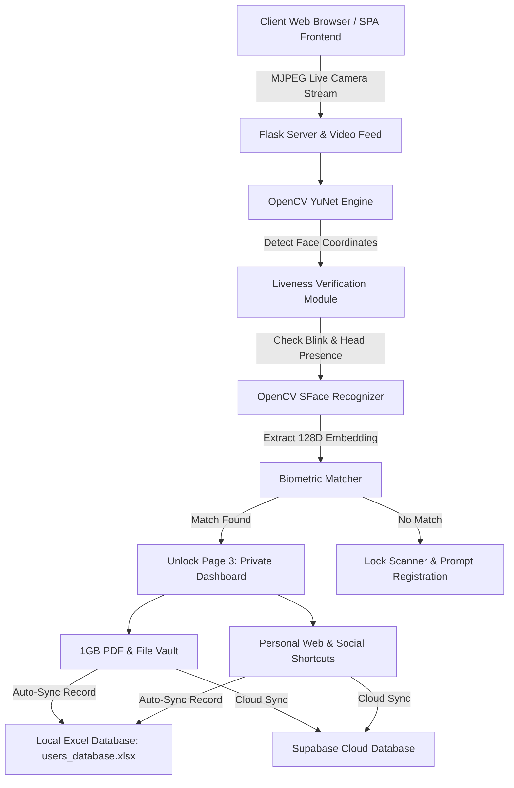

# AI Face Unlock 🔓


An enterprise-grade, **3-Page Biometric Single Page Application (SPA)** that locks personal digital workspaces behind real-time AI face recognition and anti-spoofing liveness verification. Features private personal document storage (1GB Vault), automatic local Excel spreadsheet synchronization, and Supabase cloud database integration.

---

## 🏗️ System Architecture



---

## ⚡ How It Works (3-Page Workflow)

```text
 ┌───────────────────────────┐      ┌───────────────────────────┐      ┌───────────────────────────┐
 │   PAGE 1: WELCOME LANDING  │ ───► │ PAGE 2: BIOMETRIC SCANNER │ ───► │ PAGE 3: PRIVATE DASHBOARD │
 └───────────────────────────┘      └───────────────────────────┘      └───────────────────────────┘
   High-tech entry banner &           Live webcam scanner feed &         Personal workspace loaded
   biometric workspace launcher.      interactive liveness checks.       EXCLUSIVELY for verified identity.
```

### 1. 🌐 Page 1: Welcome & Gateway
- Introduces the AI Face Unlock system with glassmorphic cards and dynamic security stats.
- Clicking **"Launch Biometric Scanner"** smoothly transitions to Page 2.

### 2. 👁️ Page 2: Biometric & Liveness Verification
- Activates the camera feed powered by **OpenCV YuNet**.
- Executes interactive liveness challenges (eye blink verification + steady head presence detection) to prevent photo spoofing.
- Compares extracted 128D facial embeddings against stored biometric feature vectors using **SFace** cosine similarity (`threshold = 0.363`).
- **Privacy Gating**: Public identity lists are hidden from Page 2 to ensure total data privacy.

### 3. 🔐 Page 3: Face-Locked Personal Workspace & 1GB Storage
- Once authenticated, Page 3 unlocks **exclusively for the face-verified identity**:
  - **Personal Social & Web Links**: Dedicated shortcuts for GitHub, LinkedIn, Instagram, and web apps.
  - **1GB Secure PDF & Document Vault**: Dedicated file storage meter (`0.0 MB / 1024 MB`) with upload, download, and delete actions.
  - **Zero Exposure**: Other registered identities, photos, or documents remain completely invisible and protected.

---

## 📊 Automatic Excel Database Synchronization (`users_database.xlsx`)

Whenever a user registers their face identity, adds a personal link, or uploads a PDF document to their vault, the backend automatically writes to a local Microsoft Excel spreadsheet at `data/users_database.xlsx`.

### 📑 Excel Sheet Layout & Schema:

```text
┌────────┬─────────┬─────────────────────────┬─────────────────────┬─────────────────────────────────┬──────────┬───────────┬───────────────────┬───────────┐
│ Faceid │  name   │       Face Image        │    Enrolled Date    │             github              │ Linkedin │ Instagram │        pds        │ remaining │
├────────┼─────────┼─────────────────────────┼─────────────────────┼─────────────────────────────────┼──────────┼───────────┼───────────────────┼───────────┤
│   1    │ Sainath │ 1788285273_sainath.jpg  │ 2026-09-01 23:24:33 │ https://github.com/sainathgoud │   None   │   None    │ my_resume_ES.pdf  │   None    │
│   2    │ Ram     │ 1788285991_ram.jpg      │ 2026-09-01 23:40:12 │ https://github.com/ramdev       │   None   │   None    │ project_docs.pdf  │   None    │
└────────┴─────────┴─────────────────────────┴─────────────────────┴─────────────────────────────────┴──────────┴───────────┴───────────────────┴───────────┘
```

- **`Faceid`**: Sequential numeric identifier (`1`, `2`, `3`...).
- **`name`**: Full name of the registered user.
- **`Face Image`**: Cropped face photo filename saved in `data/faces/`.
- **`Enrolled Date`**: Timestamp of identity enrollment.
- **`github`**: Automatically parsed GitHub profile URL.
- **`Linkedin`**: Automatically parsed LinkedIn profile URL.
- **`Instagram`**: Automatically parsed Instagram handle/URL.
- **`pds`**: List of uploaded PDF filenames stored in the 1GB Document Vault.
- **`remaining`**: Any custom user links or notes.

---

## 📂 Project Directory Structure

```text
AI-Face-Unlock/
├── data/                    # Private local database storage (ignored in git)
│   ├── users_db.json        # JSON user records & feature embeddings
│   ├── users_database.xlsx  # Native formatted Excel spreadsheet
│   ├── users_database.csv   # CSV database export
│   ├── faces/               # Enrolled cropped face photos
│   └── user_files/          # Uploaded vault PDFs & documents
├── models/                  # ONNX AI Models (YuNet detection & SFace recognition)
├── src/                     # Backend Python Modules
│   ├── config.py            # Central thresholds & model paths
│   ├── liveness_detection.py# Anti-spoofing liveness verification engine
│   ├── model_loader.py      # ONNX model loader & YuNet sensitivity tuner
│   ├── server.py           # Flask web server & MJPEG streaming routes
│   ├── supabase_client.py   # Supabase cloud database synchronization
│   └── user_manager.py      # User CRUD & Excel spreadsheet builder
├── static/                  # Glassmorphic Frontend Assets
│   ├── css/style.css        # Premium dark glassmorphism stylesheet
│   └── js/app.js            # Single Page Application router & polling
├── templates/               # HTML Templates
│   └── index.html           # SPA template (3-Page views & modals)
├── .gitignore               # Strict security & privacy git exclusions
├── requirements.txt         # Dependency manifest
├── render.yaml              # Render web service configuration
├── vercel.json              # Vercel serverless deployment config
└── wsgi.py                  # Web server WSGI entrypoint
```

---

## ☁️ Cloud & Server Deployment

### 🔴 Render Deployment (Full Video Streaming Support)
1. Connect your repository to [Render](https://render.com).
2. Create a new **Web Service**.
3. Render automatically detects `render.yaml` and executes:
   ```bash
   gunicorn wsgi:app --bind 0.0.0.0:$PORT
   ```

### ⚡ Vercel Deployment
1. Import repository into [Vercel](https://vercel.com).
2. Vercel automatically applies `vercel.json` routing through `wsgi.py`.

---

## 🔒 Data Privacy & Security

- **Strict Git Exclusions**: All sensitive user records, face crop photos, Excel spreadsheets, and uploaded PDFs in `data/` are excluded via `.gitignore`.
- **Zero Browser Exposure**: Public download buttons for user databases are removed to prevent unauthorized data downloads from client browsers.
- **Local Isolation**: All identity files are saved locally on disk at `c:\Users\SAINATH\github projects\AI-Face-Unlock-main\AI-Face-Unlock-main\data\users_database.xlsx`.
