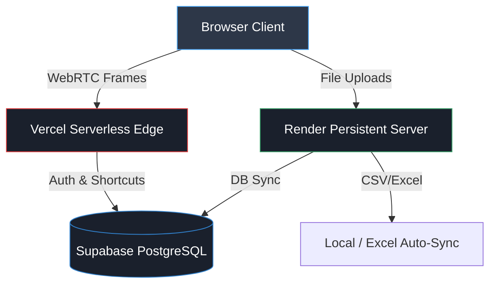

<div align="center">
  
  <h1>AI Face-Vault</h1>
  <p><strong>A Next-Gen Biometric Authentication System & Personal Vault</strong></p>

  <p>
    <a href="https://ai-face-unlock.onrender.com"><strong>Render Live Demo</strong></a> · 
    <a href="https://ai-face-unlock.vercel.app"><strong>Vercel Edge Demo</strong></a>
  </p>

</div>

---

## 🌟 Overview
**AI Face-Vault** is a futuristic, highly secure web application that uses real-time facial recognition to authenticate users. Once authenticated, users gain access to a personal, encrypted vault where they can store important documents (PDFs), manage fast-access links, and view their login history.

Designed with privacy and speed in mind, it utilizes edge computing (Vercel) for rapid frontend delivery and persistent cloud backends (Render + Supabase) for secure data storage.

---

## ✨ Features
- 🛡️ **Biometric Security:** Real-time facial detection and recognition using OpenCV's advanced YuNet and SFace models.
- 📸 **WebRTC Camera Pipeline:** Browser-native high-performance camera streaming that bypasses cloud container hardware restrictions.
- ⚡ **Stateless Edge Authentication:** Vercel serverless deployment instantly identifies users against a synced Supabase cloud database.
- 🗄️ **Personal Digital Vault:** Store PDFs and documents securely. *(Note: File storage requires persistent disk hosting like Render or local execution).*
- 🔗 **Shortcut Manager:** Add, edit, and delete quick links to your GitHub, LinkedIn, or favorite sites.
- 📊 **Dynamic Telemetry:** Real-time tracking of facial yaw/pitch, smile probability, and biometric confidence scores.

---

## 🏗️ System Architecture

This project employs a **Hybrid Cloud Architecture** to maximize performance while ensuring data persistence.



### Components
1. **Frontend / Edge (Vercel):** Extremely fast response times for the WebRTC feed. Since it is stateless, it pulls user identity directly from Supabase.
2. **Persistent Backend (Render):** Handles heavy lifting such as PDF file storage (which requires a hard drive) and syncing local JSON/Excel databases.
3. **Database (Supabase):** The central source of truth for user embeddings and shortcut data, ensuring both Vercel and Render always see the same users.

---

## 🚀 Quick Setup (Local Development)

### Prerequisites
- Python 3.9+
- A working webcam

### Installation
1. **Clone the repository:**
   ```bash
   git clone https://github.com/yourusername/AI-Face-Unlock.git
   cd AI-Face-Unlock
   ```

2. **Install Dependencies:**
   ```bash
   pip install -r requirements.txt
   ```

3. **Configure Environment:**
   Create a `.env` file based on `.env.example`:
   ```bash
   cp .env.example .env
   ```
   Add your Supabase URL and Anon Key to the `.env` file if you want cloud synchronization.

4. **Run the Server:**
   ```bash
   python src/server.py
   ```
   *The AI models will automatically download on the first run.*

5. **Open in Browser:** Navigate to `http://127.0.0.1:5000`

---

## 🔮 Future Integrations
- **Supabase Storage:** Migrate document uploads from local disk to Supabase S3 buckets to allow file uploads directly from the stateless Vercel edge.
- **JWT Session Tokens:** Implement cryptographic session tokens upon successful facial verification to persist authentication across browser tabs.
- **Liveness Detection Checks:** Force users to perform randomized challenges (e.g., "Blink Twice", "Turn Head Left") to prevent spoofing with photos.
- **Supabase Realtime:** Stream live login events to a global admin dashboard.

---

<div align="center">
  <p>Built with ❤️ using Flask, OpenCV, WebRTC, and Supabase.</p>
</div>
